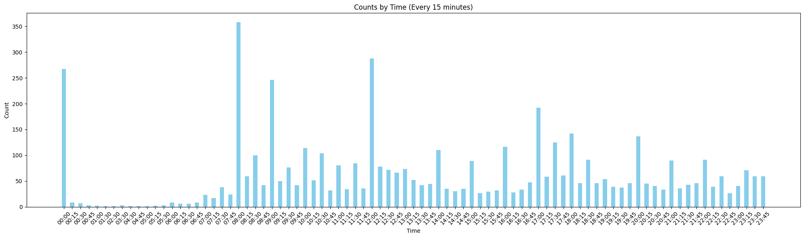

# Wechat-Scholar

提供稳定的**学术类**微信公众号转RSS服务.

何为**学术类**？主打学术资讯、论文分享、高质量科普.

## 时效

- 保留最新20条（或近7日）的内容;

- 文章发布时间12小时内完成更新;

- 每日**08:15**，**12:15**和**17:15**更新;（根据过往公众号推送情况修订，参见下图）

## 收录情况

- 总计155个，2025.02.
- ~~总计147个，2024.11.~~
- ~~总计133个，2024.9.~~
- ~~总计117个，2024.2.~~
- ~~总计124个，2024.1.~~
- ~~总计81个，2023.12.~~
- ~~总计48个，2023.11.~~

## 如何订阅

- 在[channels.json](./channels.json)中寻找公众号名称，复制Links栏地址至RSS阅读器;

- **或**通过`subscriptions.opml`直接导入所有频道;

- **或**通过[Follow](https://app.follow.is/list/71378259800441856)订阅;

- 如列表中找不到您需要的公众号，请移步[Issues](https://github.com/osnsyc/Wechat-Scholar/issues).

## 说明

- 此项目只提供**学术类**公众号转RSS，其它类目需求勿扰;

- 不提供全文输出，请在RSS客户端获取全文;

- 收录容量有限，本人保留是否添加新增公众号请求的权利.

## 相关项目

- [osnsyc/Scholar-to-RSS](https://github.com/osnsyc/Scholar-to-RSS), 谷歌学术转RSS.
- [osnsyc/WoS-to-RSS](https://github.com/osnsyc/WoS-to-RSS), Web of Science Alert to RSS

